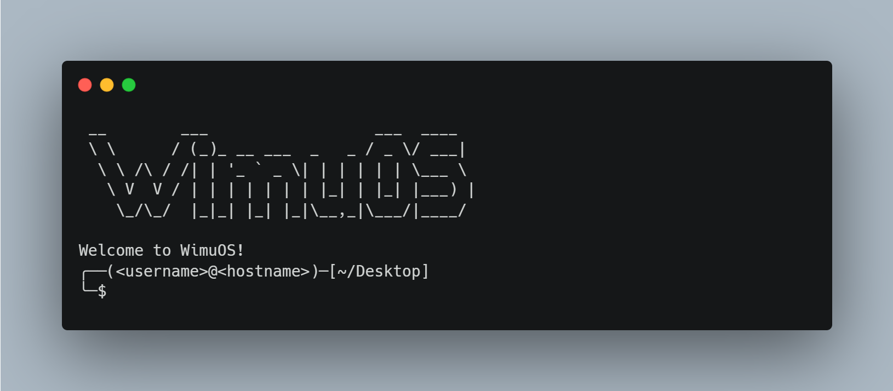

<div style="display: flex; align-items: center; justify-content: center;">
    
    <pre style="font-size: 12px; line-height: 1.5;">    
 __        ___                  ___  ____  
 \ \      / (_)_ __ ___  _   _ / _ \/ ___|
  \ \ /\ / /| | '_ ` _ \| | | | | | \___ \
   \ V  V / | | | | | | | |_| | |_| |___) |
    \_/\_/  |_|_| |_| |_|\__,_|\___/|____/
    </pre>
</div>

# WimuOS

WimuOS is an alternative virtual operating system featuring Kali Linux's terminal looks with in-memory file system to provide linux type filesystem.

## Why WimuOS?

WimuOS is supposed to be a side project but I had fun creating this project as the owner of it. It made me learn a bit more of typescript.

## How does WimuOS work?

WimuOS uses virtual filesystem or in memory filesystem to provide a linux feel of filesystem. The whole system is written in typescript, own programming language which is based on typescript with global variables, etc.

WimuOS terminal uses the Kali Linux's terminal theme which is cool for most terminals.

WimuOS also provides multiuser support (Login commands through os will be added.) which allows connecting through multiple users, main user and one user per time.

## Okay I downloaded this, how do i run it?

> You can either use the wiki or use the instructions right down here:

If it's your first time installing WimuOS then run:

```bash
wimu setup
```

To begin the wimu os setup which provides inputs for creating new users, hostname and selecting a main user.

And to run the os after setup simpily run:

```bash
wimu run
```

And the OS will start with the output down below:

<p align="center">
    
</p>

## What is the structure of the project?

```txt
wimu
├── bin | Includes Executable files for the project source code (DO NOT TOUCH UNLESS YOU KNOW WHAT YOUR DOING!)
├── src | Source code of the project, the code is open source so feel free to edit but becareful with your changes
├── memfs | Includes the files and folders which will be copied to the virtual fs
│  ├── wimu | Main wimu system directory
│  │  ├── sys | Includes system files which can have commands, kernel, etc.
│  │  ├── conf | Includes configuration for the system
│  │  ├── lib | System & program libraries
│  ├── Users | Includes user directories per user
|  ├── wimubin | Includes programs
└── setup | Includes setup of wimu
```

### ? Faq

- I cant write code because I don't have intellisense!

For vscode or any other languages set the default language for: `.wimu`, `.wimusys` and `.wimulib` to either Typescript or Javascript

For `.wimuenv` set it as Environment language
For `.wimuconf` set it as Yaml

- How can I write libraries?
